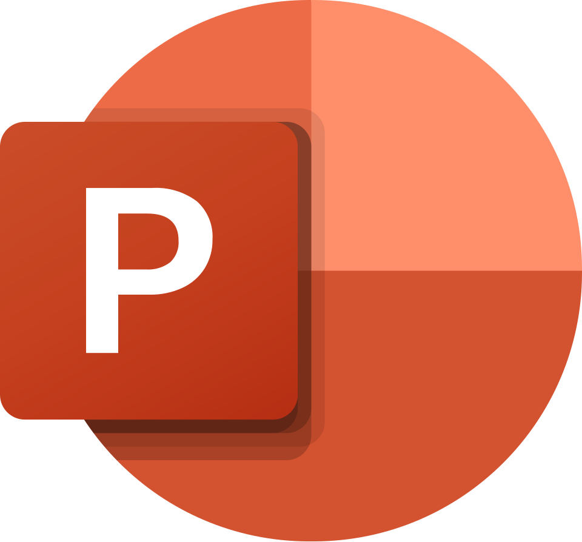
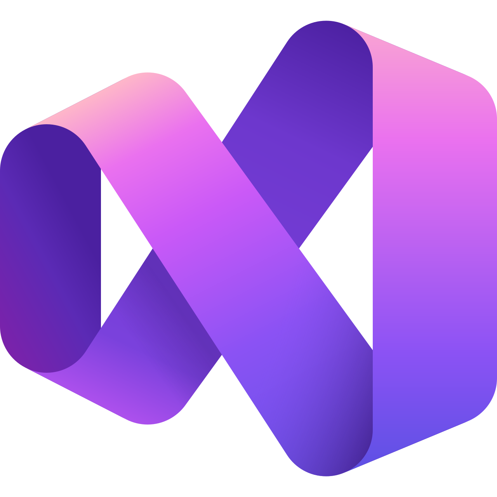

<h1 align="center">Encrypted</h1>
 
<br>
<p>Hello, we are Encrypted!</p>
<p>Encrypted is a team of young, ambitious developers driven by curiosity and a passion for building meaningful software. Our latest project is a console‑based application inspired by the structure of a school website, designed to make learning feel a bit more like an adventure than an obligation.

Inside the app, users can take geography tests that challenge their knowledge, track their progress, and sharpen their skills in a simple, engaging environment. It’s a small project with a big purpose: proving that even with minimal tools, creativity and teamwork can produce something genuinely useful.</p>
<br>
 
<h2 align="left">🚀 Languages and Libraries </h2>
<p align="left">
<a href="https://cplusplus.com"></a>
</p>
 
<h2 align="left">🔧 Used Tools </h2>
<p align="left">
   
   
   
   
   
 <br>
 
<h2 align="left">📄 Documents</h2><br>
  <ul>
    <li><a href="documentation/Encrypted_Documentation.docx">Documentation</a></li>
    <li><a href="documentation/Encrypted_Presentation.pptx
">Presentation</a></li>
  </ul>  
 
<h2 align="left">👨🏻💻 Team Members </h2>
<table >
  <tr>
    <td align="center">Name</td>
    <td align="center">Role</td>
    <td align="center">Grade</td>
    <td align="center">Github</td>
  </tr>
    <tr>
    <td align="center">Iliyan Iliev</td>
    <td align="center">Scrum Trainer</td>
    <td align="center">🟩 9V</td>
    <td align="center"> <a href="https://github.com/IHIliev24">IHIliev24 </a></td>
  </tr>
  <tr>
    <td align="center">Maksim Iliev</td>
    <td align="center">Backend developer</td>
    <td align="center">🟩 9V</td>
    <td align="center"> <a href="https://github.com/MaxIliev27">MaxIliev27 </a></td>
  </tr>
  <tr>
    <td align="center">Dimitar Dimitrov</td>
    <td align="center">Frontend developer</td>
    <td align="center">🟩 9V</td>
    <td align="center"> <a href="https://github.com/DPDimitrov24">DPDimitrov24 </a></td>
  </tr>

  <tr>
    <td align="center">Ivan Kolozenko</td>
    <td align="center">Designer</td>
    <td align="center">🟨 9A</td>
    <td align="center"> <a href="https://github.com/ISKolozenko24">ISKolozenko24 </a></td>
  </tr>
  </table>
<br>
 
 <h2 align="left">🔑 Access</h2>
 
 <p> Open cmd and clone our repo by typing</p>
 
```
https://github.com/IHIliev24/Encrypted.git
```
